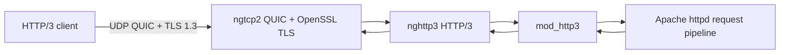

# Architecture

`mod_http3` adds a QUIC/HTTP/3 path to Apache httpd while retaining Apache's request processing, virtual hosts, filters, and configuration model.

## Layers

- **ngtcp2** owns the transport: packets, loss recovery, flow control and
  streams. **OpenSSL** runs the TLS 1.3 handshake through its QUIC TLS API.
  See [The QUIC layer](#the-quic-layer).
- **nghttp3** handles HTTP/3 frames, streams, and QPACK interactions.
- **mod_http3** bridges QUIC streams with Apache request/response processing.
- **Apache httpd** supplies routing, virtual-host selection, filters, and handlers.
- **APR and APR-util** provide the portable runtime services used by the module and host daemon.

## The QUIC layer

Every ngtcp2 and OpenSSL call the module makes lives under `quic/`, behind
symbols prefixed `h3q_`. This is a wrapper, not an abstraction. There is one
transport, ngtcp2 with OpenSSL as its TLS backend, and the layer exists to keep
`ngtcp2_conn*` and `SSL*` out of the rest of the module, not to allow a second
implementation. The engine reads the UDP socket itself, maps connection IDs to
connections, answers Retry and Version Negotiation, and runs the ngtcp2 timers.

Nothing outside `quic/` includes an ngtcp2 or OpenSSL header, and the
published API documentation excludes both `detail/` directories.

The module hands over one `h3q_config`, holding the TLS context, the idle
timeout, the stream limit, whether to validate client addresses with a Retry
packet and whether to accept 0-RTT, and gets back an opaque `h3q_engine`. Connections and streams are opaque too, so
`<openssl/ssl.h>` stays out of every header above this layer. Failures come
back through a caller-supplied error buffer rather than the log, because
`quic/` has no `server_rec` to log against.

nghttp3 sits above this layer and never sees it. One behaviour is worth
knowing: ngtcp2 does not copy stream data, so the buffers nghttp3 hands out
stay in place until the peer acknowledges them. The engine reports each
acknowledgement through the `stream_acked` callback and the module passes it
to nghttp3, which then releases the buffer.

0-RTT: with `H3EarlyData on`, a resumed client may send its first request
before the handshake completes. The engine queues such streams, the module
starts the session at once and runs safe methods immediately; other methods
wait until the handshake completes, because 0-RTT data can be replayed
(RFC 8470). The safe-method rule is the replay defence; the TLS layer sets
`SSL_OP_NO_ANTI_REPLAY`, since OpenSSL's own anti-replay is built for TLS
over TCP and refuses QUIC resumption with early data.

## Important Boundaries

HTTP/3 connections are UDP/QUIC connections, but request processing runs through standard Apache machinery. HTTP/3 is advertised over existing TCP responses using `Alt-Svc`; clients then establish QUIC on the advertised UDP port.

The module's listener presents the certificate of the first VirtualHost that serves HTTP/3 (`h3` in `Protocols` on a host with a mod_ssl certificate); the certificate is loaded in `post_config`, before privileges drop. Name-based virtual host selection then uses the request authority. IP-based virtual hosts remain unsupported because the necessary per-connection local address is not currently recovered.

See the [configuration guide](configuration.md) for operational control points.
